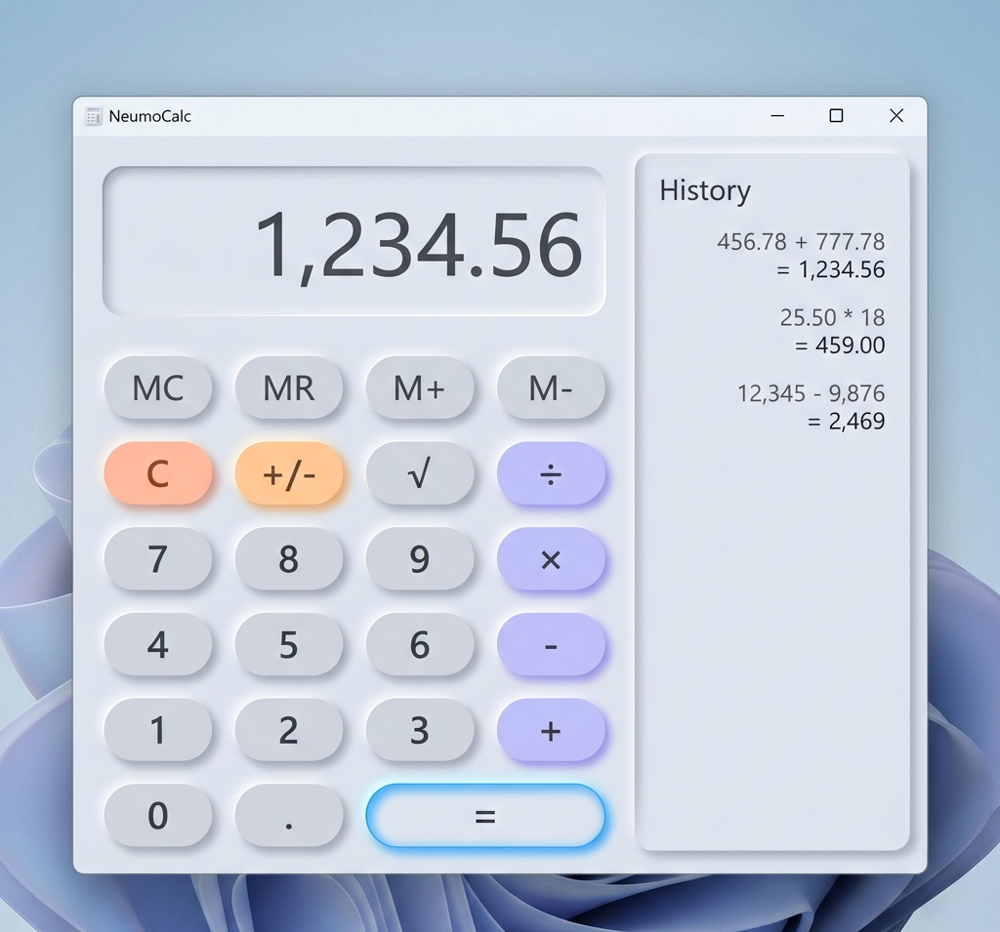

# ✦ Modern Neumorphic Calculator

A premium, high-performance Windows Forms calculator built with **.NET 8**. Featuring a sleek **Light Neumorphic** user interface, advanced scientific functions, and a persistent history log.



---

## 🚀 Key Features

| Category       | Features              | Description                                                            |
| :------------- | :-------------------- | :--------------------------------------------------------------------- |
| **🎨 Design**  | Neumorphic UI         | Soft shadows and highlights for a modern 3D look.                      |
| **📐 Modes**   | Standard & Scientific | Toggle between basic math and complex functions (sin, cos, log, etc.). |
| **📜 History** | Calculation Log       | Persistent history panel to track and clear past operations.           |
| **💡 UX**      | Animations            | Smooth hover/press transitions and rounded pill buttons.               |
| **⌨️ Input**   | Keyboard Support      | Fully mapped keyboard shortcuts for efficient operation.               |
| **🧠 Memory**  | M+, MR, MS, MC        | Standard memory functions with an on-display indicator.                |

---

## 🛠️ Technical Stack

| Component        | Technology                                         |
| :--------------- | :------------------------------------------------- |
| **Framework**    | .NET 8.0 (Windows Forms)                           |
| **Language**     | C# (Modern Syntax)                                 |
| **Architecture** | Programmatic UI (No Designer dependency)           |
| **UI engine**    | System.Drawing (GDI+) with custom double-buffering |

---

## ⌨️ Keyboard Shortcuts

| Key                | Action                                     |
| :----------------- | :----------------------------------------- |
| **0 - 9**          | Input Digits                               |
| **+ , - , \* , /** | Arithmetic Operators                       |
| **Enter / =**      | Calculate Result                           |
| **Backspace**      | Delete Last Digit                          |
| **Escape / C**     | Clear All                                  |
| **Delete / CE**    | Clear Entry                                |
| **F1 - F4**        | Scientific Shortcuts (sin, cos, tan, sqrt) |

---

## 📦 How to Build & Run

### 1. Prerequisites

- **.NET 8 SDK** installed on your system.

### 2. Move to Project Directory

```powershell
cd "c:\Users\naive\Documents\Collage\DOTNET\Calculator\Proggram"
```

### 3. Build & Publish

```powershell
dotnet publish Calculator.csproj -c Release -r win-x64 --self-contained true -o "$env:USERPROFILE\Desktop\ModernCalc"
```

### 4. Run Application

```powershell
& "$env:USERPROFILE\Desktop\ModernCalc\ModernCalculator.exe"
```

---

## 📁 Project Structure

| Folder      | Contents                                                |
| :---------- | :------------------------------------------------------ |
| `Proggram/` | All source code (`.cs`), project and solution files.    |
| `assets/`   | UI resources, icons, and screenshots for documentation. |

---

> [!TIP]
> Use the **HIST** toggle in the title bar to quickly view your calculation history. You can close it using the **✕** button on the panel itself!

---

_Created with ❤️ for Modern Windows Environments._
